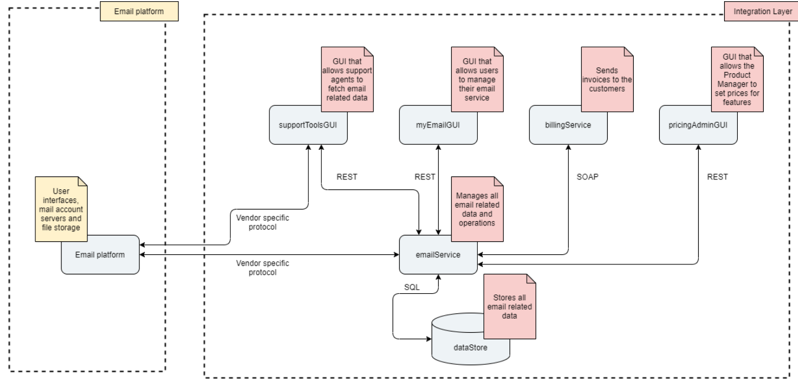
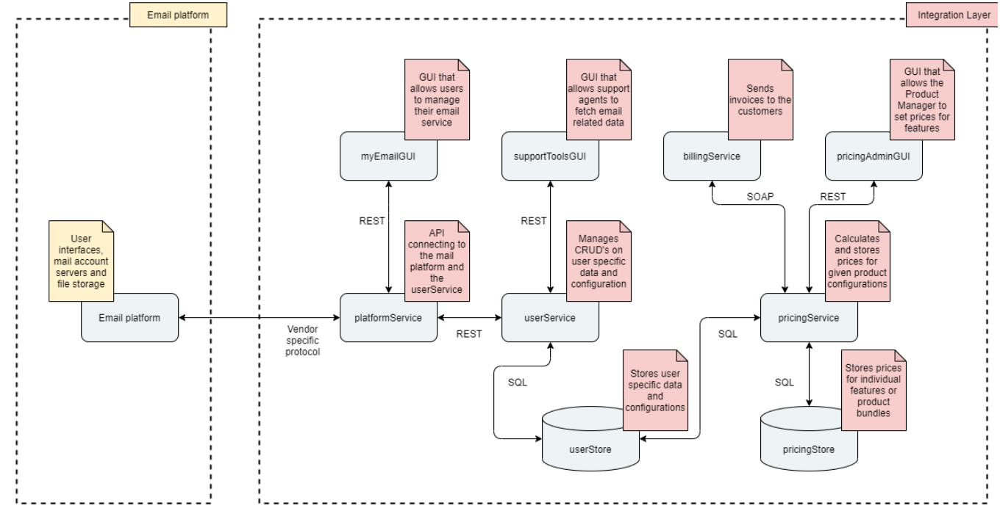

# Solution to home assignment Swisscom/Bluewin
## Part 1

Task: Discuss potential issues with architecture 1 and 2.
      TODO: Am I also supposed to give at least one thing speaking for using each architecture too? Circle back to this.

### Architecture 1: Centralized logic with an over use of "vendor specific interface".

* Overly dependent on vendor specific interface: The vendor specific interface is used in multiple places. It would make sense to abstract away this interface to minimize the amount of code being directly dependent on it. If, in the future, the interface would have to be changed, then we do not want to be overly dependent on it.
* It is probably better if peripheral services only have one interface towards the system.
  This makes it easier for supportTool developers to know from where any new type of data must be collected from.  It also makes it easier to control the peripherals and their data access. Say for example that you as a customer must consent to the support agent being able to collect information about you. If the support tool only interfaces the emailService then this kind of logic would only have to be implemented there.
* The email service becomes a "one-size-fits-all" code. It should be able to handle everything, which could make the code unnecessarily complex. It also does not allow for as finetuned scaling as Architecture 2 (in architecture 2 we could scale up the user service part if needed, without necessarily increasing the resources for the pricing service).

### Architecture 2: Overly decentralized logic.

* The platformService abstracts away the vendor specific interface from most of the integration layer logic, which is an improvement to architecture 1.
* Moving myEmailGUI such that it interfaces the userService directly (as in Architecture 3) would probably make more sense. As I understand it the myEmailGUI is mainly for managing your personal settings stored in the userStore, which is exactly what the userService should handle. The platformService would just end up forwarding everything between the myEmailGUI and the userService anyway.
* To split the logic in userService and pricingService (and the corresponding databases) makes sense. Setting prices on products/services is not very connected to how we handle user settings. I think that Architecture 3 solves it nicer though; by not allowing the pricingService to read the userStore database directly it does not have to be bothered with HOW user data is stored in the database. Signaling what needs to be shared between the user- and pricingService instead makes it easier to make changes to the userStore, while keeping the interface between the services unchanged. 

## Part 2

Task: Code part of userService from architecture 3.

1. TODO: Build a REST API for the myEmailGUI to update the email quota. 
   Done: PUT request http://localhost:8081/my-email-api/user-configurations/1 where emailQuotaInGB
         should be specified in the body
2. TODO: Build a dummy implementation for calculating the updated price after the quota change
   Done: Not clear what we wanted the information for, but I chose to save it in the database and
         send it back to the myEmailGUI
3. TODO: Save the updated quota to the userStore database and the email platform
   Ongoing: Have to figure out how to best to a rollback of database changes if updating the email
            platform fails.
4. TODO: Code up at least one automated test for your implementation
   Done: Have two unit tests testing the service layer.
5. TODO: Build a REST API for the supportToolsGUI to read a customer's email quota
   Done: GET request of the form: http://localhost:8081/support-tool-api/user-configurations/1

